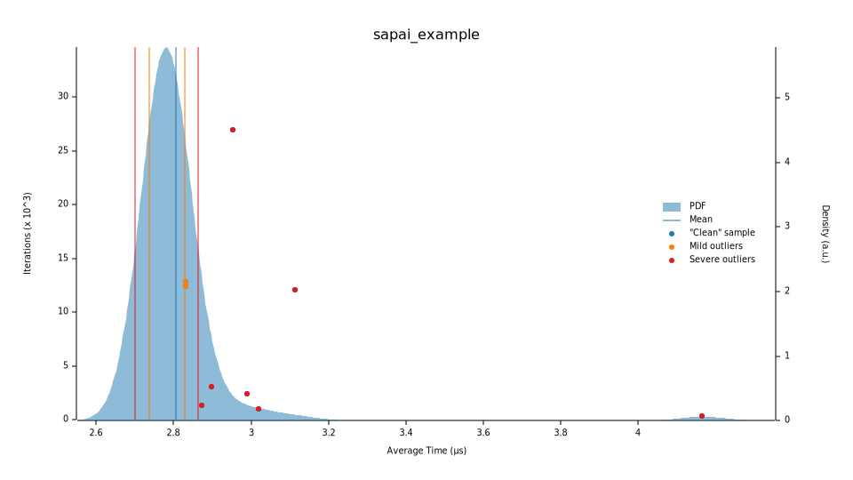

# SAPTest
[](https://crates.io/crates/saptest)
[](https://docs.rs/saptest/latest/saptest/)
[](https://github.com/koisland/SuperAutoTest/actions/workflows/ci.yaml)
[](https://codecov.io/gh/koisland/SuperAutoTest)


Database and testing framework for Super Auto Pets.

Game information is queried from the [Super Auto Pets Fandom wiki](https://superautopets.fandom.com/wiki) page and stored in a `SQLite` database.

---

## Usage

### Teams
Build a `Team` and simulate battles between them.

Then visualize the results in `.dot` format!
```rust
use saptest::{
    Pet, PetName, Food, FoodName,
    Team, TeamCombat, Position, create_battle_digraph
};
// Create a team.
let mut team = Team::new(
    &vec![Some(Pet::try_from(PetName::Ant).unwrap()); 5],
    5
).unwrap();
let mut enemy_team = team.clone();

// Set a seed for a team.
team.set_seed(Some(25));

// Give food to pets.
team.set_item(&Position::First, Food::try_from(FoodName::Garlic).ok()).unwrap();
enemy_team.set_item(&Position::First, Food::try_from(FoodName::Garlic).ok()).unwrap();

// And fight!
team.fight(&mut enemy_team).unwrap();

// Create a graph of the fight.
println!("{}", create_battle_digraph(&team, false));
```

```
digraph {
    rankdir=LR
    node [shape=box, style="rounded, filled", fontname="Arial"]
    edge [fontname="Arial"]
    0 [ label = "Ant_0 - The Fragile Truckers_copy" ]
    1 [ label = "Ant_0 - The Fragile Truckers", fillcolor = "yellow" ]
    2 [ label = "Ant_3 - The Fragile Truckers", fillcolor = "yellow" ]
    3 [ label = "Ant_4 - The Fragile Truckers_copy" ]
    0 -> 1 [ label = "(Attack, Damage (0, 1), Phase: 1)" ]
    1 -> 0 [ label = "(Attack, Damage (0, 1), Phase: 1)" ]
    1 -> 2 [ label = "(Faint, Add (2, 1), Phase: 1)" ]
    0 -> 3 [ label = "(Faint, Add (2, 1), Phase: 1)" ]
}
```

Graphs can be as simple as the example above... or extremely complex.

<p float="left">
    
    
</p>

### Shops
Add shop functionality to a `Team` and roll, freeze, buy/sell pets and foods.
```rust
use saptest::{
    Shop, ShopItem, TeamShopping, Team,
    Position, Entity, EntityName, FoodName,
    db::pack::Pack
};

// All teams are constructed with a shop at tier 1.
let mut team = Team::default();

// All shop functionality is supported.
team.set_shop_seed(Some(1212))
    .set_shop_packs(&[Pack::Turtle])
    .open_shop().unwrap()
    .buy(
        &Position::First, // From first.
        &Entity::Pet, // Pet
        &Position::First // To first position, merging if possible.
    ).unwrap()
    .move_pets(
        &Position::First, // First pet.
        &Position::Relative(-2), // To pet 2 slots behind. Otherwise, ignore.
        true // And merge them if possible.
    ).unwrap()
    .sell(&Position::First).unwrap()
    .freeze_shop(&Position::Last, &Entity::Pet).unwrap()
    .roll_shop().unwrap()
    .close_shop().unwrap();

// Shops can be built separately and can replace a team's shop.
let mut tier_5_shop = Shop::new(3, Some(42)).unwrap();
let weakness = ShopItem::new(
    EntityName::Food(FoodName::Weak),
    5
).unwrap();
tier_5_shop.add_item(weakness).unwrap();
team.replace_shop(tier_5_shop).unwrap();
```

### Pets
Build custom `Pet`s and `Effect`s.
```rust
use saptest::{
    Pet, PetName, PetCombat,
    Food, FoodName,
    Entity, Position, Effect, Statistics,
    effects::{
        trigger::TRIGGER_START_BATTLE,
        actions::GainType,
        state::Target,
        actions::Action
    }
};
// Create known pets.
let mut pet = Pet::try_from(PetName::Ant).unwrap();

// Or custom pets and effects.
let custom_effect = Effect::new(
    Entity::Pet,
    TRIGGER_START_BATTLE, // Effect trigger
    Target::Friend, // Target
    Position::Adjacent, // Positions
    Action::Gain(GainType::DefaultItem(FoodName::Melon)), // Action
    Some(1), // Number of uses.
    false, // Is temporary.
);
let mut custom_pet = Pet::custom(
    "MelonBear",
    Statistics::new(50, 50).unwrap(),
    &[custom_effect],
);

// Fight two pets individually as well.
// Note: Effects don't activate here.
pet.attack(&mut custom_pet);
```

### Logging
Enable logging with `log4rs` with `build_log_config` to view battle logic.
```rust
use saptest::logging::build_log_config;

let config = build_log_config();
log4rs::init_config(config).unwrap();

// Code below.
...
```

### Config
To configure the global `SapDB`'s startup, create a `.saptest.toml` file in the root of your project.
* Specify page versions for pets, foods, and tokens to query.
* Toggle recurring updates on startup.
* Set database filename.

```toml
[database]
# https://superautopets.fandom.com/wiki/Pets?oldid=4883
pets_version = 4883
filename = "./sap.db"
update_on_startup = false
```

Graph building can also be disabled in `[general]` with `build_graph`.
```toml
[general]
build_graph = false
```
---

## Benchmarks
Benchmarks for `saptest` are located in `benches/battle_benchmarks.rs` and run using the [`criterion`](https://docs.rs/crate/criterion/latest) crate.
* Compared against [`sapai`](https://github.com/manny405/sapai#battles), a Super Auto Pets testing framework written in Python.
* Both tests were run on an AMD Ryzen 5 5600 6-Core Processor @ 3.50 GHz.

```bash
# saptest
git clone git@github.com:koisland/SuperAutoTest.git --depth 1
cargo add cargo-tarpaulin
cargo bench && open target/criterion/sapai_example/report/index.html
```

```bash
# sapai
cd benches/
git clone https://github.com/manny405/sapai.git && cd sapai
python setup.py install
# Then run `battle_benchmarks_sapai.ipynb`.
```

### saptest (No Graphs)
* **48.763 ns ± 149.36 ns** with **100 measurements**.
* Logging disabled.
* Raw data available in `benches/saptest_raw_no_graphs.csv`.


### saptest (Graphs)
* **2.6677 µs ± 208.77 ns** with **100 measurements**.
    * This is a **5370% regression in speed** compared to no graphs.
    * Consider disabling `graphs` if speed is required.
* Logging disabled.
* Raw data available in `benches/saptest_raw_graphs.csv`.



### sapai
* **4.29 ms ± 51.8 µs** per loop (mean ± std. dev. of 7 runs, **100 loops each**)

---

## TODO:
* Add trait for randomly generating teams.
* Make structs thread-safe.

---
## Sources
* https://superautopets.fandom.com/wiki
* https://emoji.supply/kitchen/
* https://github.com/manny405/sapai
* ["ADVANCED Mechanics in Super Auto Pets (Guide)"](https://www.youtube.com/watch?v=NSqjuA32AoA) by Blueberry Pieper
